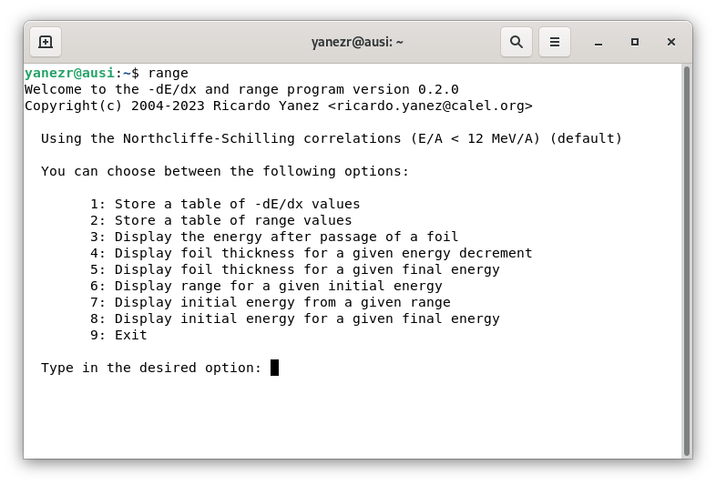

# rangelib - stopping power and range C/C++ library

_rangelib_ is a stopping power and range library written in C. It creates and stores in memory range tables based on the Northcliffe-Schilling[1] and Hubert-Bimbot-Gauvin[2] correlations. These can be used to calculate the energy loss of an ion after passage through a foil, or the incoming energy prior to passage based on the outgoing energy, or the range of an ion in a material, or the thickness of a foil to produce a desired energy loss.

Since the Northcliffe-Schilling and Hubert-Bimbot-Gauvin correlations are valid for E/A &lt; 12 MeV/A and 2.5 &lt; E/A &lt; 500 MeV/A, respectively, this library is mostly useful in analyzes of nuclear physics experiments in the low (E/A &lt; 10 MeV/A) and intermediate (10 &lt; E/A &lt; 150 MeV/A) energy regimes, where usually a projectile, or reaction product, lose energy in the target material, dead layers in a detector, or in transmission detectors where only a fraction of the energy is deposited.

The library consists of four functions, _passage()_, _egassap()_, _rangen()_ and _thickn()_, and the program _range_ which is a front-end to the library useful for quick estimations. The function _passage()_ returns the ion energy after passage through an absorber, whereas _egassap()_ returns the ingoing ion energy, given the energy after passage. If you know the energy of a beam, _passage()_ can be used to calculate the energy deposited in a detector, or the energy lost through a target foil or dead layer. Similarly, if you know the energy deposited by a reaction product in a detector, _egassap()_ can be used to calculate its initial energy, prior to energy loss. The function _rangen()_ returns the range of a projectile in a given material, and the function _thickn()_ returns the absorber thickness needed to produce a given energy loss.

## Installation

```  
$ git clone https://github.com/ricardoyanez/rangelib.git
$ cd rangelib
$ mkdir build
$ cd build
$ cmake ..
$ sudo make install
$ sudo ldconfig
```

## Usage

range is a front-end to various -dE/dx and range calculating functions. If you know what -dE/dx is you will have no problems running this program.



The program asks for the ion and absorber details and, where necessary, the energy of the ion and thickness of the absorber.

The header and shared/static library needed to access the functions are specially constructed to provide an easy calculation of the energy loss of an ion after passage through a foil. This is particularly useful in analyzes of nuclear physics experiments where usually a projectile, or reaction products, lose energy in the target material or dead layers in detectors and energy loss corrections are needed.

The syntax of the functions is,

```c
#include <range.h>

double passage(int icorr, int zp, int ap, int iabso, 
               int zt, int at, double ein, double t, double *err);

double egassap(int icorr, int zp, int ap, int iabso,
               int zt, int at, double t, double eout, double *err);

double rangen(int icorr, int zp, int ap, int iabso, int zt, int at, double ein);

double thickn(int icorr, int zp, int ap, int iabso, int zt, int at, double ein, double de);
```

where _icorr_ is a switch for selecting the Northcliffe-Schilling or Hubert-Bimbot-Gauvin correlations, _zp_, _ap_, _zt_ and _at_ are the atomic and mass numbers of the ion (projectile) and absorber (target), respectively, the switch _iabso_ selects the type of absorber and/or compound (see Absorber Compounds below).

See the manual page _rangelib(3)_ for a detailed explanation of the functions, options and switches,

    $ man rangelib

### Density of gases

To express the density of a gas (at T=298 K) in terms of its pressure in Torr,

    density[mg/cm3] = P[Torr] x 5.38083e-5 x molecular weight

The constant `5.38083e-5` can be deduced using the gas law at NTP. Gases are commonly used in ionization chambers.

### Density of solids

Some useful densities of solids commonly used as target, backing or detector material,

```
C : 2267 mg/cm3
Al : 2702 mg/cm3
Si : 2321 mg/cm3
Au : 19310 mg/cm3
```

## Absorber Compounds

The absorber is defined by _iabso_. The absorber can be a single element, a predefined or a user-defined compound,

```
iabso=0    Single compound defined by zt and at
iabso>0    Predefined compound (see table below)
iabso=-1   User defined compound
```

The predefined compounds are commonly encountered in Nuclear Physics experiments.


| _iabso_ | Compound name | State | Density (mg/cm<sup>3</sup>) |
|---|---|---|---|
| 1 | Mylar (C<sub>10</sub>H<sub>8</sub>O<sub>4</sub>) | solid | 1397 | 
| 2 | Polyethylene (C<sub>2</sub>H<sub>4</sub>) | solid | 930 |
| 3 | Polypropylene (C<sub>3</sub>H<sub>6</sub>) | solid | 	900 |
|	4 | Kapton (H<sub>10</sub>C<sub>22</sub>N<sub>2</sub>O<sub>5</sub>) | solid | 1430 |
|	5 | Cesium Iodine (CsI) | solid | 4510 |
|	6 | Sodium Iodine (NaI) | solid | 3670 |
|	7 | Aluminum Oxide (Al<sub>2</sub>O<sub>3</sub>) | solid | 3980 |
|	8 | Tin-Lead (Sn60/Pb40) | solid | 8420 |
|	9 | Nickel (Ni-nat) | solid | 8902 |
|	10 | Uranium tetrafluoride (UF<sub>4</sub>) | solid | 6700 |
|	11 | Thorium tetrafluoride (ThF<sub>4</sub>) | solid | 6300 |
|	 12 | Stainless Steel (316L) | solid | 7990 |

and for commonly used gases,

|*iabso* | Compound | State | Density at T=298 K (mg/cm<sup>3</sup>) |
|----|---|---|---|
| 100 | Carbon tetrafluoride (CF<sub>4</sub>) | gas | P(Torr) x 4.73538e-3 |
| 101 | Propane (C<sub>3</sub>H<sub>8</sub>) | gas |  P(Torr) x 2.37276e-3 |
| 102 | Butane (C<sub>4</sub>H<sub>10</sub>) | gas |  P(Torr) x 3.12752e-3 |
| 103 | Octane (C<sub>8</sub>H<sub>18</sub>) | gas |  P(Torr) x 6.14657e-3 |

These predefined compounds can be listed with,

    $ range --list
 
A user defined compound is selected by `iabso=-1` and is stored in the array `absorb` of structures `elem`, all of which are defined in `range.h` as follows:

```c
int nelem;
struct elem {
  int z;                 /* atomic number */
  int a;                 /* mass number */
  double w;              /* mass weight */
} absorb[NELMAX];
```

The  variable `nelem` defines the number of elements in the absorber (max 10). The examples below show how to define an absorber compound.

## Examples

The following code, [passage.c](examples/passage.c) calculates the energy loss of alpha particles in air,

```c
/*
 * passage.c 
 *
 * Written by Ricardo Yanez <ricardo.yanez@calel.org> 
 *
 */

#include <stdio.h>
#include <range.h>

/* Calculate energy loss of alpha particles in air */

int main () {

  int i;
  double dens, t;
  double d;
  double ein, eout, eut, err;

  /* define absorber (air) */
  nelem = 3;
  absorb[0].z = 8;  absorb[0].a = 16; absorb[0].w = 2*16*23.2; /* O2 */
  absorb[1].z = 7;  absorb[1].a = 14; absorb[1].w = 2*14*75.5; /* N2 */
  absorb[2].z = 18; absorb[2].a = 40; absorb[2].w = 1*40*1.3;  /* Ar */

  /* density of air at 1 atm (see README file) */
  dens = 760.0 * 5.38083e-5 * (2*16*23.2 + 2*14*75.5 + 1*40*1.3);

  /* If you want to be more accurate you can use molecular weights instead
     of mass numbers when defining the weights */

  printf("\nCalculating the energy of an alpha particle in air\n\n");

  printf("Initial \t mm of air \t final\n");
  printf("energy  \t           \t energy\n");
  printf("(MeV)   \t           \t [1]    \t [2]\n");
  printf("------- \t --------- \t ------\n");
  ein = 25.0;
  for (i = 0 ; i < 10 ; i++) {
    d = (i+1) / 20.0;
    t = dens * d;
    eout = passage(0,2,4,-1,0,0,ein,t,&err);
    eut = passage(1,2,4,-1,0,0,ein,t,&err);
    printf("%6.1lf \t\t %6.3lf \t %6.2lf \t %6.2lf\n",ein,d*10.0,eout,eut);
  }

  printf("\n[1] Northcliffe-Schilling correlations\n");
  printf("[2] Hubert-Bimbot-Gauvin correlations\n\n");

  return 0;

}
```

This code can be compiled with the command,

    $ gcc -g -O -Wall passage.c -lrange -lm -o passage

and then executed,

```
$ ./passage

Calculating the energy of an alpha particle in air

Initial 	 mm of air 	 final
energy  	           	 energy
(MeV)   	           	 [1]    	 [2]
------- 	 --------- 	 ------
  25.0 		  0.500 	  23.60 	  23.57
  25.0 		  1.000 	  22.14 	  22.08
  25.0 		  1.500 	  20.60 	  20.50
  25.0 		  2.000 	  18.96 	  18.82
  25.0 		  2.500 	  17.21 	  17.01
  25.0 		  3.000 	  15.30 	  15.05
  25.0 		  3.500 	  13.19 	  12.87
  25.0 		  4.000 	  10.78 	  10.38
  25.0 		  4.500 	   7.88 	   7.37
  25.0 		  5.000 	   3.74 	   2.72

[1] Northcliffe-Schilling correlations
[2] Hubert-Bimbot-Gauvin correlations
```

Likewise, the code [rangeair.c](examples/rangeair.c) calculates the range of protons in air for energies ranging from 1 to 20 MeV.

These examples can be found in `/usr/local/share/doc/range/examples/` and be compiled with

    $ cd /usr/local/share/doc/range/examples/
    $ make

## ROOT and C++

To use the range functions in [ROOT](https://root.cern.ch), load the range library with,

    gSystem->Load("/usr/local/lib/librange")
 
then compile the code as usual. For example, the code [testRange.C](examples/testRange.C),

```
root [0] gSystem->Load("/usr/local/lib/librange")
root [1] .L testRange.C++
root [2] testRange()
98.9758
119.114
139.215
157.807
263.747
```

This example can be found in <tt>/usr/local/share/doc/range/examples/</tt>.

## Acknowledgment
Calculations with `rangelib` are done by constructing range tables according to the Northcliffe-Schilling correlations  and Hubert-Bimbot-Gauvin correlations. The method of constructing range tables to interpolate to desired range values is due to late Prof. Jan-Olov Liljenzin, Chalmers Institute of Technology, Sweden. The original program written in Fortran was inherited to me during my time as a Ph.D. student at Uppsala University. Since the source code was not intended for the general public it was never copyrighted in any sense, I have taken the liberty to take parts of the original code, at least the spirit, port it to C and license it under GPL in the interest of a broader scientific community. Due acknowledgments to Prof. Jan-Olov Liljenzin, or JOL as we all knew him.

## References
[1] - [C. Northcliffe, R.F. Schilling, Nucl. Data Tables A7, 233 (1970).](https://doi.org/10.1016/S0092-640X(70)80016-X)  
[2] - [F. Hubert, R. Rimbot and H. Gauvin, Atomic Data and Nuclear Data Tables 46, pp. 1-213 (1990). ](https://doi.org/10.1016/0092-640X(90)90001-Z)
